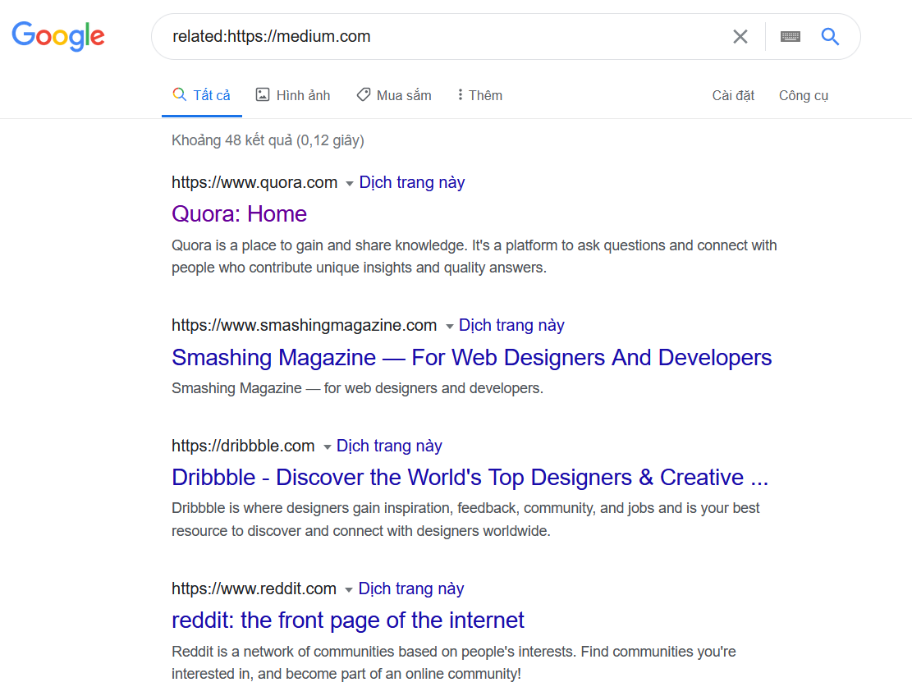

# CÁCH SỬ DỤNG GOOGLE VÀ GOOGLE SCHOLAR ĐỂ TÌM KIẾM THÔNG TIN SAO CHO HIỆU QUẢ

Nhóm 006:

- Vũ Ngọc Tú 18520184
- Trần Lê Bảo Châu 18520256
- Lê Công Minh 18521099

## 1. Cách tìm kiếm thông tin trên Google hiệu quả:
### 1.1 Chỉnh sửa câu truy vấn có thêm Keyword.

Câu truy vấn của Google được cấu tạo bởi một hay nhiều keywords. 
Các keywords người dùng nhập vào sẽ được so sánh với cơ sở dữ liệu của Google; càng nhiều keyword được tìm thấy trên một trang web thì khả năng đúng càng cao. Vì thế cần phải thêm keyword mô tả những gì cần tìm càng nhiều càng tốt. Việc nhập ít keyword- thông tin trong câu truy vấn dễ làm cho google hiểu sai ý và trả ra kết quả không như ý muốn. Sử dụng càng nhiều keyword, google càng dễ dàng hơn trả ra kết quả chính xác.

### 1.2 Sử dụng toán tử OR để mở rộng phạm vi kết quả trả về
Thông thường, Google sẽ tự động giả định có từ "and" giữa tất cả các từ trong câu truy vấn. Nghĩa là nếu nhập 2 từ, Google sẽ tìm những trang có cả 2 từ đó. Để mở rộng phạm vi tìm kiếm bằng cách tìm những trang chỉ có 1 trong cấc từ nhập vào, có thể sử dụng toán tử OR.

### 1.3 Tìm kiếm những trang tương tự
Để tìm kiếm những trang web mà google nghĩ là có nội dung tương tự. Sử dụng toán tử related:

## 2. Cách tìm kiếm trên Google Scholar hiệu quả:
### 2.1 Thêm năm trong truy vấn.
Việc thêm năm vào trong câu truy vấn sẽ trả về những bài báo được xuất bản trong chính xác năm đó.

### 2.2 Sử dụng dấu ngoặc kép để tìm được chính xác cụm từ.
Cả Google và Google Scholar đều tách các từ riêng rẽ với nhau khi tìm kiếm. Nếu muốn tìm kiếm đúng cụm từ ta phải sử dụng dấu ngoặc kép 2 bên cụm từ đó.

### 2.3 Đọc dòng cuối cùng  "Cited by" và các bài báo tương tự.
"Cited by" là số lượt mà bài báo này đã được trích dẫn. Nó sẽ cho ta biết được về độ ảnh hưởng của bài báo đó (càng nhiều người trích dẫn thì bài đó càng nhiều ảnh hưởng).
Bên cạnh đó nút dấu ngoặc kép bên trái cũng là phương pháp để trích dẫn đúng format chuẩn.
Related articles dẫn đến link những bài báo tương tự.

